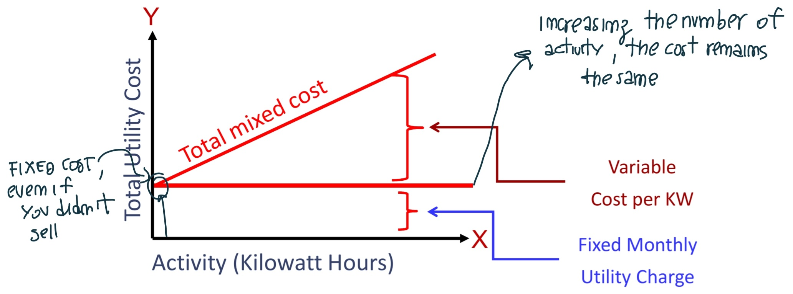
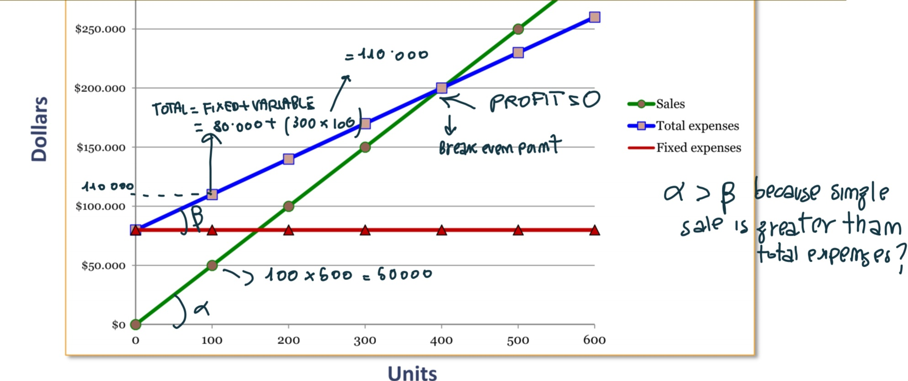
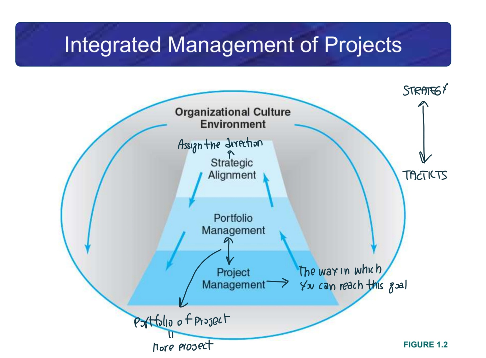
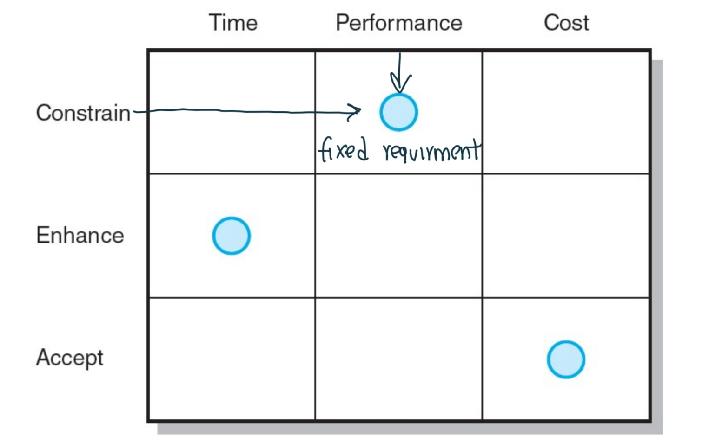

# ETM Lesson Notes 💵
#### By Enrico Fortuna ©️

## 0 - Decision-making methods
- **Likert scale**: An instrument for measuring opinions and attitudes;
- **Academics**: They want to satisfy **future needs**;
- **Industry expert**: They want to satisfy **current needs**;
- **Stakeholders**: Individuals who hold some kind of interest, especially in economics.
- **Shareholders**: Individuals who own at least one share of a company's stock.
- **Critical variable**: If you change it, you identify alternative scenarious, giving solidity to your results (not always);
- **Sensitivity analysis**: You change 1 variable;
- **Scenario analysis**: You change more than 1 variable; 
- **Risk analysis**: You use probability;

## 1 - Managerial Accounting and Cost Concepts

### Needs of Management
- **Financial accounting** (External): Must follow only cashflow.
- **Managerial accounting** (Managers): Manager has responsability, it is not simple. He must check the work of his workers. Manager has more attention to worker life instead of common life. 
- **Financial VS Economics**: The former is about money, the latter is about money and externalities.
- **Externalities**: Externalities are the **unintended** side effects of an economic activity that affect parties not directly involved in the activity. These effects can be positive or negative and often occur when the costs or benefits of an activity are not fully accounted for by the parties involved. In other words externality or external cost is an indirect cost or benefit to an uninvolved third party that arises as an effect of another party's (or parties') activity.
- **Balance Sheet**: Necessary for the legal actions, representing the sum of the relevant parts of a specific moment (all activity of a specific moment). It refers to the past and use *ammortizzamento*. It only use historical values or some estimations. Instead a **Project Investiment** use estimations.
In other words the Balance Sheet is a financial statement that reports assets, liabilities and owner's equity on a specific date: **Assets** (*attività*) = **Liability** (*passività*) + **Equity** (*capitale netto*).

### Assigning Costs to Cost Objects
- **Direct costs**: Costs that can be easily traced to a unit of product or other cost object. E.g.: ***direct material*** (*euro / product*), ***direct labor*** (*euro / hours*, salary of single worker). 
- **Indirect cost**: Costs that cannot be easily traced to a unit of product. Example: ***Manufacturing overhead*** (*only the cost / # of products*, if all the product have the same parts).

### Classifications of Costs
- **Manufacturing costs** includes raw, in progress and finished, and are Direct Materials, Direct Labor and Manufacturing overhead:
    - ***Direct Materials***: Raw materials that become an intergal part of the product (*e.g. A radio installed in an automobile*);
    - ***Direct Labor***: Those labor costs that can be easily traced to individual units of product (*e.g. Wages paid to automobile assemply workers*);
    - ***Manufacturing overhead***: All manufacturing costs **except** direct material and direct labor. These cannot be readily traced to finished products. (*e.g. maintenance workers and security guards  &rarr; they check for several rooms, they are not clearly associated*). 
- **Manufacturing costs** are often classified as follows:
    - **Prime Costs** = Dirtect material + Direct Labor. 
    - **Conversion Cost** = Direct Labor + Manufacturing Overhead.
- **Nonmanufacturing Costs** (Period costs?) includes:
    - **Selling Costs**: Costs necessary to secure the order and deliver the product (can be either direct or indirect);
    - **Administrative Costs**: Alle executive, organizational, and clerical costs. 
- **Product Costs**: Include all costs that are involved in acquiring or making a product. 
- **Manufacturing Product Costs**: for manufacturing companies, product costs include: **Raw materials**, **Work in progress** and **finished goods costs**. 
    - **3 Problems of Work in Progress**: *Bottleneck*, *Space needed* & *Lack of Money Liquidity* (you must ask money to the banks  &rarr; you have already sustained the cost but you have not gained anything yet).
- **Prosumer**: Consumer + Producer (like a plant);
- **Complementary product**: You can sell a product at low price in order to attact the market towards another product, but the two products mnust be correlated. The second product is called complementary; 

### Cost Classification for Predicting Cost Behavior
- **Cost beahviour** refers to how a cost will react to changes in the level of activity. The most common classifications are:
    - **Variable costs**: a cost that varies, in total, in direct proportion to changes in the level of activity. A variable cost per unit is constant (Cost of 20 products < Cost of 30 &rarr; the costs usually directly increase with the number of products);
    - **Fixed Cost**: A cost that remains constant, in total, regardless of changes in the level of the activity.
    - **Mixed Costs**: contains both variable and fixed elements. 
    
     > ℹ️ **Note**: It is not always good to product more, it depends from the market. 

### Cost classification for Decision Making
- **ABC rule (Activity based costing)**: aggregate the costs that represent the majority of the cost. It can be used to identify potentially relevant costs for decision-making purposes. 
- **Differential Cost**: Are the difference in cost between any two alternatives.
- **Sunk Costs**: They have already been incurred and you can't return to the initial point.
- **Opportunity  Cost**: The potential benefit that is given up when one altertnative is selected over another. 

## 2. Introduction to the business

- **Business**: is an **organization** that uses **resources** to meet the needs of customer by providing **products** (also goods) or **services** that they demand. 
- **Production process**: is usually distinguished in:
    - **Capital Intensive**: machinery and other parts realized in investment;
    - **Labour Intensive**: Workers. 
- **Business Size**: is measured with the **number of employees**:
    - **Small and Medium Enterprises** (SMEs): company with less than 250 employees;
    - **Large Enterprises**: more than 250 employees. 
- **Organizational structures**:
    - **Functional structure**: it is very simple, divided for each category;
    - **Divisional Structure**: It is used when the differences between two market and products are relevant;
    - **Matrix Structure**: you analyze two dimensions. It is more complex, more suitable for complex situation, but it increases in costs. 
- **Industries**: A group of companies that operate in the same segment of economy. 
- **Competitive Advantage**: is an attribute, or a series of attributes, that allows a company to outperform its competitors and gain a favourable competitive position (with **innovation**). 
    - **Innovation**: The commercialization of an invention, the ability to change the current work;

## 3. Cost Volume Profit (CVP) Relationships 

> **Assumption**: 1. *Selling price is constant. The price of a product or service will not change as volume changes.* 2. *Costs are linear and can be divided into variable and fixed components.* 3. *In multiproduct companies, the mix of products sold remains constant.*
- **Contribution margin (CM)**: is the amount remaining from sales revenue after variable expenses have been deducted (**CM = Sales - Variable Expenses**). 
- **Net operating income**: CM is used to cover fixed expenses. Any remaining CM contributes to net operating income (**CM - Fixed expenses**).
- **Profit** = **CM - Fixed Expenses** =  **(Sales - Variable expenses) - Fixed Expenses**:
    - **Sales** = Quantity sold **(Q)** **x** Selling price per unit **(P)**;
    - **Variable expenses** = Quantity sold **(Q)** **x** Variable expenses per unit **(V)**;
    - **Profit = (Q x P - Q x V) - Fixed expenses** = **(P - V) x Q - Fixed expenses** = **Unit CM x Q - Fixed expenses**. 
    
- **Contribution Margin Ratio (CM Ratio)**: is the CM as a percentage of sales: \[ CM \; ratio = \frac{Contribution \; margin}{sales} = \frac{Contribution \; Margin \; Per \; Unit}{Selling \; Price \; Per \; Unit}\]

    > **⚠️ Attention**: If you have two firm, you compare the CM ratio. 

- **Variable Expense Ratio**: is the variable expenses as a percentage of sales:

\[ Variable \; expense \; ratio = \frac{Variable \; expenses}{Sales}\]

- **Break-even point**: is the production level (Q) at which total revenues equal total expenses &rarr; **Profit** = **Unit CM** x **Q** - **Fixed Expenses** &rarr; \$0 = \$200 x Q - Fixed expenses &rarr; \$200 x Q = \$0 = \$80000 &rarr; Q = 400. 
    - Formula Method &rarr; $ Unit \; sales \; to \; break \; even = \frac{Fixed \; expenses}{CM \; per \; unit}$
- **Target Profit analysis**: We estimate what sales volume is needed to achieve a specific target profit. The same of break even but you put **Profit** equal to **Target Profit** instead of **\$0**.
- **Margin of safety**: is the excess of budgeted or actual sales dollars over the break-even volume of sales dollars. **Margin of safety in dollars = Total sales - Break-even sales**. 
- **Sales Mix**: When a company sells different products. 
- **Sustainability hand**: A point of equilibrium between stakeholders (it is not simple to define this point).
- **Outsourcing**: Hiring a party outside a company to perform services or create goods that were traditionally performed in-house by the company's own employees and staff. If you externalize your **core** alternative, you will have several issues. 

## 4. Job-Order Costing

- **Job-order Costing** is a costing method which is used to determine the cost of manifacturing each product. Infact it is used when many different products are produced each period; products are manufactured to order. 
- **Make to stock**: Products are readily available (Commercial Product).
- **Make to order**: Production starts only after receiving a custom order.
- **Pretermined overhead rate (POHR)**: it is used to apply overhead to jobs and is determined before the period begins. **POHR = Estimated total manufacturing overhead cost for the coming period / estimated total units in the allocation base for the coming period**. 

## 5. Pricing Decisions
- **Elasticity of Demand**: It measures the degree to which the unit sales of a product or service are affected by a change in unit price. A demand for a product is:
    - **Inelastic**: If a change in price has little effect on the number of units solds;
    - **Elastic**: If a change in price has a substantial effect on the number of units solds;
- **Markups**: It refers to the amount added to the cost price of goods to cover overhead and profit.
- **Price ceiling**: The highest price at which a good or service can be sold; 

## 6. The Concept of Present Value

> **"A dollar received today is worth more than a dollar received a year from now beacuse you can put it in the bank today and have more than a dollar a year from now"**. 
- **The balance F at the end of period n**: 
\[ F_n = P(1 + r)^n \]

Where $P$ is the amount invested now; $r$ the discount rate that can't be negative; $n$ the lifetime (include also time of realization). It represents the future value (F) of an initial investment (P) compounded at a periodic interest rate (r) over n periods. If $r>1$ &rarr; $F > P$. 
- **Present  value**:  $\text{P} = \frac{F_n}{(1 + r)^n}$.

## 7. Economic Indicators
> Indicators are objective.
- **Net Present Value (NPV)**: The best indicator (No externalities): 
\[ \text{NPV} = -F_0 + \frac{F_1}{(1+r)} + \frac{F_2}{(1+r)^2} + \dots \frac{F_N}{(1+r)^N}\]
\[\text{NPV} = \sum_{t=0}^{N} \frac{F_t}{(1 + r)^t}\]
Where $F_0$ is the **initial investment**; $F_t$ the **cash flows** during period t {1...N}; $r$ the **cost opportunity of capital** (also called **discount rate** or **rate of return** which is a **Profitability standard**) and $N$ **lifetime**. 
If **NPV > 0** project accepted (profitable); If **NPV < 0** project not acccepted. 
The larger the NPV is the more it is to be considered. NPV measure the profit of a project about the present, and it is based on estimated cashflow. 
**Why NPV is the best method?** Because through the cost opportunity, it is able to aggregate all future cash flows. It considers aldo the inflaction (tha value of money can change).

- **Payback Time (PBT)**: To find PBT you sum cashflows for each period until it equals or exceeds zero:
\[ \sum_{t=0}^{PBT} F_t = 0 \]
It stop to the payback time. The **two problems of PBT** are the following:
    1. Discount rate is not considered;
    2. What happens after PBT? We does not know. 
A project is accepted if **PBT < cutoff period**. If PBT > cutoff  period a project is not accepted. 
- **Cutoff Period**: it is the period (usually in years) below which a project's payback period must fall in order to accept the project. Its unit of measure is *years*. **Cutoff is decided by the investors** and it is totally **subjective**. The maximum value is the lifetime of the project. 
- **Discounted Payback Time (DPBT)**: Is the PBT but considering also the discount rate:
\[ \sum_{t=0}^{DPBT} \frac{F_t}{(1+r)^t} = 0 \]
It has only one problem: you analyze only a part of the lifetime (the period in which you have recovered the initial investment), what happens later is unknown.  
The unit of measure is time. The difference between generic and specific? No difference. It can be measured only in time.
If **Discount payback time < Cutoff period** the project is feasible;
- **Internal Rate of Return (IRR)**: It is a **profitability measure** (you calculate it) which represents the discount rate that makes the NPV of all cash flows from the investment equal to zero:
\[\sum_{t=0}^{N} \frac{F_t}{(1+IRR)^t} = 0\]
In other words the IRR is the discount rate that sets the NPV of an investment’s cash flows (both inflows and outflows) to zero, and is expressed in percentage. 
    - **IRR > cost opportunity of capital** the project is **accepted**;
    - **IRR < cost opportunity of capital** the project is **noaccepted**. 

    > ℹ️ **Note**:  When you calculate PBT or DPBT remember to start from year 0. 

- **Profitability Index (PI)**: The unit of measure is dimensionless: $\frac{NPV (\$)}{Initial Investment (\$)}$; The PI cannot be used when more than one resource is rationated. 
If you have multiple products you use the **Weighted Average Profitability Index (WPI)**. Its approach is to penalize some decisions. 
- **ROI**: Return of an Investment = How much money do you obtain after make some investment = **Net Operative Income / Investment**.
### Additional Material 

- **Minimum Attractive Rate of Return (MARR)**: is a cutoff rate representing a yield on investment that is considered minimally acceptable (*il tasso minimo di rendimento richiesto per investire in un progetto, assicurando che il rendimento dell'investimento sia almeno pari o superiore a tale tasso.*)
**Decision rules on incremental investment (i=MAAR)**:
    - If $\text(PV(MARR)_{A2-A1}) > 0$ &rarr; accept $A_2$;
    - If $\text(PV(MARR)_{A2-A1}) \leq 0$ &rarr; accept $A_1$;
    - If $\text(FV(MARR)_{A2-A1}) > 0$ &rarr; accept $A_2$;
    - If $\text(FV(MARR)_{A2-A1}) \leq 0$ &rarr; accept $A_1$;
- **Evaluating Public Activities Benefit-Cost Analysis**: 
    - **Private Activites** &rarr; **Profits**;
    - **Public Activities** &rarr; **Welfare**;
- **Benefit-Cost Analysis**: **BC(i) = Equivalent Benefits / Equivalent Costs**:
    - **Aggregated benefit-cost ratio:**
        \[ R_A = \frac{B}{I + C'} > 1\]
        Where $I$ is the initial investment, $C'$ the operative cost (you aggregate costs, I + C'). 
        If ,for example, $R_A$ is equal 2, you have benefits that are 2 times the costs. 
    - **Net benefit-cost ratio**:
        \[R_N = \frac{B - C'}{I} > 1\]
        Here you separate the costs (C' and I). 
    In general, **benefits $\neq$ revenues** because benefits encompass other aspects besides revenues.  

        
    > ℹ️ **Note**: The simple cost-benefit analysis can't be used when you have two alternatives; you need an **incremental** cost-benefit analysis.

## 8. Project management
- **What is a project?**: A temporary endeavour undertaken to create a unique product, service, or result:
    - Has an estabilished objective;
    - Has a defined life span with a beginning and an end;
    - Requires across-the-organizatonal participation;
    - has a specific time, cost, and performance requirements.
Usually a project has a short lifetime, and tipically has a deadline. If you don't respect it &rarr; **penalty**. If the project is **dynamic** the routine is not good. 
The project has a life cycle: the **planning** phase can be changed and is the most relative part.

- **Project manager**: has technical + social skills. The **sociocultural** aspect is a critical approach to project management. A project manager must be **flexible** and **coherent**. 
- **Demand side management**: Refers to various strategies and measures implemented to modify consumer demand for electricity, particularly during peak periods, with the aim of achieving more efficient and sustainable energy use.

### Defining the project
- There must be a point of equilibrium (**Quality**) between the **Scope**, the **Cost** and the **Time** of a project. 
-  A **priority matrix** is a tool used to prioritize tasks, projects, or other items based on certain criteria.
- **Work Breakdown Structure (WBS)** is a hierarchical outline (map) that identifies the products and work elements involved in a project.
- By integrating the WBS with the organization we obtin the **Organizational Breakdown Structure (OBS)**, which defines people responsible for the activities. 

### Estimating Project Times and Costs
- **Estimating** is the process of forecasting or approximating the time and cost of completing project deliverables. There are two types of estimates:
    
    - **Top-down (macro)** estimates which has a lower level of precision;
    - **Bottom-up (micro)** estimates; 

    The more the project is complex the more is difficult to estimate it. 

### Developing a Project Plan
- **The project Network**: is a flow chart that graphically depicts the logical sequences, start and finish times of the project activities along with the **critical path**. 
- **The critical path**: is the longest path(s) through the network. If you have a delay, not in the critical path, you have the opportunity that this delay does not influence the final result. 
More in details: 
    1. The longest path through the activity network that allows for the completion of all project-related activities;
    2. The shortest expected time in which the entire project can be completed;
    3. Delays on the critical path will delay completition of the entire project. 
- **Activity** an element of the project that requires time but may not require resources;
- **Merge Activity**: is a critical activity that has two or more preceding activities on which it depends;
- **Parallel Activities**: tipically the more costly, are activities that can occur independently and, if desired, not at the same time. 
- **Burst Activity**: an activity that has more than one activity immediatly following it. 

### Reducing Project Duration
- Thanks to **additional costs** you can have more time (Time is money).
-**Slope**: How much you need to pay to reduce time. 
**Maximum crash time**: Identifies the maximum reduction in time that you can have. 
**Crash point**: is the point at which the completion time of an activity is minimized by allocating additional resources, usually at a higher cost.

# Oral questions 
### Q: If you have two products, what is the correct organization structure to use?
A: Divisional Structure.

### Q: Where is better to invest, in the north or in the south of italy? Considering that in the south there is fiscal reduction but bureaucratic issue? 

### Q: Should you stop or continue an investment in a product that no longer sells, even if you have already tried twice?
A: You must stop the production because it is unprofitable. There is no reason to have additional investment. 

### Q: Cost vs Price, what is the difference? 
A: **Cost** is the expense incurred for making a product or a service that is sold by a company. The **Price** is the amount a customer is willing to pay for a product or a service (e.g. the professor is a cost).

### Q: When the Price (P) is less than the Cost (C)?
A: Tipically when the product is near its end of life. You must sell it (P < C is better than P = 0).

### Q: Suppose you have the two following products, which one do you prefer? 
#### 1 - More quality; 2 - More economic opportunities:
A: It depends from what is for you *economic opportunities* (Is the price near to your needs?). You can use multicriteria decision analysis to identify the weights associated with several criteria. But if you only want good quality you will choose 1. 
#### 1 - High quality; 2 - Low price
#### 1 - Lower cost; 2 - Innovative, higher cost 
A: For both, you have to understand the consumer opinion. 

### Q: What is better, 30\$ + 10\% or 30$ + 2\$? 
A: The first one: in general, a percentage is better when the starting price is greater. 

### Q: Why do we need to work with the full capacity?
A: When you have sufficient resources but also a large number of requests.

### Q: Product can have lifetime that depends of physic and technical condition. If we have physical = 10Y and technical = 50Y, what is the lifetime of the product? 
A: The minimum, 10Y. 

### Q: Is it better a project with a lifetime of 20Y or 40Y?
A: It depends. 

### Q: What is the best approach to calculate the selling price of a product? Cost-Plus pricing or Value-based one?
A: It depends from the relative part (?). The first one is the typicall of managers and generally simpler. 

### Q: What are the two main elements of divisional structure?
A: The divisions are characterized by market and product.

### Q: What is the Fisher point?
A: In its graph, you have NPV on the Y-axis and the discount rate on the X-axis. The Fisher point is the intersection point between two projects. On the right side, they converge to the same result, while on the left side, they diverge.

### Q: What is the Profitability Index?
A: $\text{PI} = \frac{NPV (\$)}{Initial Investment (\$)}$;

### Q: What is the difference between PI and NPV/Size?
A: Both metrics aim to help in investment decision-making: PI is generally used for assessing the relative attractiveness of projects when investment capital is limited; NPV/Size is used for understanding the efficiency of investments in terms of value creation.

### Q: What is the difference between Cost Opportunity of Capital and Internal Rate of Return?
A: The former is a standard, the latter is a measure, you calculate it. 

### Q: What is the difference between private and public investors?
A: The first one is about profit, the second one about welfare. 

### Q: Type of Organizational structures
A: Functional, Divisional and Matrix.

### Q: What is the difference between AHP and MCDA? 
A: AHP is a specific methodology within the broader category of MCDA. Ther latter refers to the overall approach and includes various specific methodologies, including AHP.

### Q: How does the contribution margin work, and when is it utilized with constrained resources?
A: A constrained resource is a limited resource that restricts the capacity of a process or system, such as time, personnel, or equipment. Effective management of constrained resources is crucial for optimizing efficiency and productivity.

### Q: Build network graph, calculate forward analysis and crash time. 

### Q: You have two resources, how would you allocate them?
A: If I have two projects, I evaluate which project is more profitable and allocate more resources to the more profitable one. 

### Q: What are the criticisms of AHP?
A: The difficulty in finding experts. 

### Q: What parameters allow comparing cash flows between two years?
A: 1. **Lifetime**; 2. **Discount Rate** (or cost opportunity of capital).
$F_n = P(1 + r)^n$. Where $P$ is the amount invested now; $r$ the discount rate; $n$ the lifetime. 

### Q: What method is used to identify the Discount rate?

### Q: Suppose you have two projects. Project 1 with an IRR of 28% and Project 2 with an IRR of 20%. Do you prefer Project 1 or Project 2?
A: Without any additional information you must choose the best project (28%, You get more money back).

### Q: What is the salvage value? (Valore di rimpiazzo)
A: Salvage value is the amount that an asset is estimated to be worth at the end of its useful life. It is also known as scrap value or residual value, and is used when determining the annual depreciation expense of an asset.

### Q: What does the acronym SMART mean?
A: 
S = **Specific**
M = **Measurable**
A = **Assignable**
R = **Realistic**
T = **Time related**

### Q: Give me an example of priority matrix.
A: A priority matrix is a tool used to prioritize tasks, projects, or other items based on certain criteria. Example:

### Q: How to monitoring a process?
A: 
1. Defines work (**what**);
2. Identifies time to complete a work package (**how long**);
3. Identifies a time-phased budget to complete a work package (**cost**);
4. Identifies resources needed to complete a work package (**how much**);
5. identifies a person responsible for units of work (**who**);
6. Identifies monitoring points for measuring success (**how well**). 

These points are all relevant (depends from specific point). 

### Q: What is the critical path? 
A: In a project network the critical path is the longest path(s) trough the network.

### Q: If you have a blackout on a critical path, how would you act?
A: Implement a contingency (emergenza) plan and consider outsourcing critical tasks to ensure continuity.

### Q: You have two parallel lines. You experience a delay in one of the lines and you can switch to the other, but at a high cost. Would you wait for the delay to resolve or switch to the other line?

A: I need to know first what the cost of one day of delay is. Second, what the cost of switching to the other line is. So then compare the cost of the delay (cost per day of delay multiplied by the number of days) with the additional cost of switching to the other line. If the cost of the delay exceeds the switching cost, it is more economical to switch; otherwise, waiting may be more cost-effective (I need to make a comparision between cost loses and additional cost). 

### Q: How do you calculate the Early Finish (EF) in a forward pass computation?
A: **EF = ES + Duration**

### Q: What are Total slack (SL) and Free slack (FS)?
A: 
- The **Total Slack** is referred to a specific activity and tell us the amount of time an activity can be delayed and not delayed the project. It is simply the difference between LS and ES (**SL = LS - ES**) or between LF and EF (**SL = LF - EF**). 
- The **Free SLack** is the amount of time an activity can be delayed after the start of a longer parallel activity or activities (can be calculated only for activities that are not in the critical path). Only activities that occur at the end of a chain of activities, where you have a merge activity, can have free slack. 

### Q: If you have unspent budget, what can you do with it?
A: Invest it or set it aside for another project.

### Q: What is Pert diagram?
A: PERT diagram (Program Evaluation Review Technique) is a project management tool used to plan, schedule, and coordinate tasks within a project. It visually represents the sequence of activities and their dependencies, allowing project managers to estimate the duration of a project and identify the critical path. **It focus on task dependencies and critical paths**.

### Q: How to calculate the weighted average activity time?
A: Using the following formula:
\[t_e = \frac{a + 4m + b}{6}\]
Where $t_e$ represents the **weighted average activity time**; $a$ **optimistic** activity time; $b$ **pessimistic** activity time and $m$ the **most likely** activity time. 
The variability in the activity time estimated is approximated by the following equations:
    - **Standard deviation** for the activity:
    \[\sigma_{t_e} = \left(  \frac{b-a}{6}\right)\]
    - The standard deviation for the project:
    \[\sigma_{T_e} = \sqrt{\Sigma \sigma^2_{t_e}}\]
        
> ℹ️ **Note**: The standard deviation of the activity is squared in this equation; this is also called variance ($\sigma^2_{t_e}$). This sum ($\Sigma \sigma^2_{t_e}$) includes only activities on the critical path(s). 

### Q: Why time is money?
A: Because Cashflow in a different period and different periods have different money. 

### Q: When does a company outsource?
A: A company outsources when it seeks to **reduce costs**, access specialized skills, or focus on core activities. This typically happens when external providers can perform tasks more efficiently or effectively than internal resources.

### Q: What is a Gantt Charts?
A: A chart that illustrates a project schedule. It usually depicts tha tasks involved in a project, the duration, the stard and end dates.
**It  focus on timelines and progress tracking**.