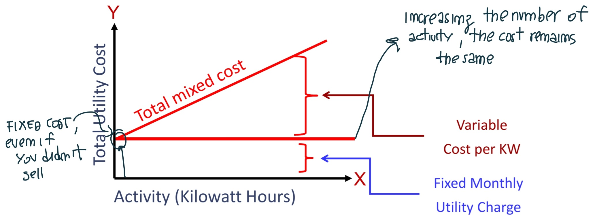
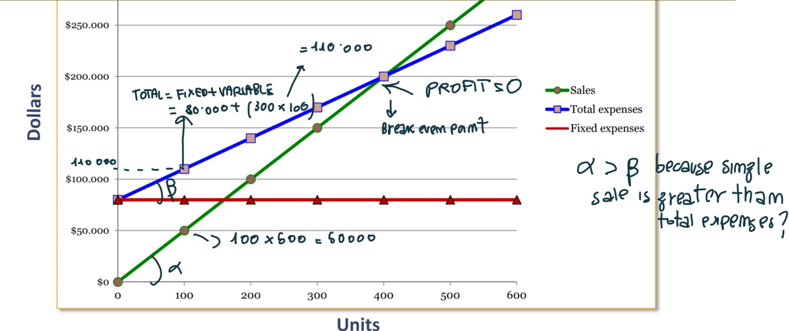

# ETM Lesson Notes

- **Critical variable**: If you change it, you identify alternative scenarious, giving solidity to your results (not always);
- **sensitivity analysis**: You change 1 variable;
- **Scenario analysis**: You change more than 1 variable; 
- **Risk analysis**: You use probability;
- **Prosumer**: Consumer + Producer (like a plant);
- **Demand side management**:
- **Complementary product**: You can sell a product at low price in order to attact the market towards another product, but the two products mnust be correlated. The second product is called complementary; 

## 0 - Decision-making methods
- **Likert scale**: An instrument for measuring opinions and attitudes;
- **Academics**: They want to satisfy **future needs**;
- **Industry expert**: They want to satisfy **current needs**;

## 1 - Managerial Accounting and Cost Concepts

### Needs of Management
- **Financial accounting** (External): Must follow only cashflow.
- **Managerial accounting** (Managers): Manager has responsability, it is not simple. He must check the work of his workers. Manager has more attention to worker life instead of common life. 
- **Financial VS Economics**: The former is about money, the latter is about money and externalities.
- **Balance Sheet**: Necessary for the legal actions, representing the sum of the relevant parts of a specific moment (all activity of a specific moment). It refers to the past and use *ammortizzamento*. It only use historical values or some estimations. Instead a **Project Investiment** use estimations.
More precisely it is a financial statement that reports assets, liabilities and owner's equityon a specific date: **Assets** (*attività*) = **Liability** (*passività*) + **Equity** (*capitale netto*).

### Assigning Costs to Cost Objects
- **Direct costs**: Costs that can be easily traced to a unit of product or other cost object. Example: ***direct material*** (*euro / product*), ***direct labor*** (*euro / hours*, salary of single worker). 
- **Indirect cost**: Costs that cannot be easily traced to a unit of product. Example: ***Manufacturing overhead*** (*only the cost / # of products*, if all the product have the same parts).

### Classifications of Costs
- **Manufacturing costs** includes raw, in progress and finished, and are Direct Materials, Direct Labor, Manufacturing overhead:
    - ***Direct Materials***: Raw materials that become an intergal part of the product (e.g. A radio installed in an automobile);
    - ***Direct Labor***: Those labor costs that can be easily traced to individual units of product (e.g. Wages paid to automobile assemply workers);
    - ***Manufacturing overhead***: All manufacturing costs **except** direct material and direct labor. These cannot be readily traced to finished products. (e.g. maintenance workers and security guards  &rarr; they check for several rooms, they are not clearly associated). 
- **Manufacturing costs** are often classified as follows:
    - **Prime Costs** = Dirtect material + Direct Labor. 
    - **Conversion Cost** = Direct Labor + Manufacturing Overhead.
- **Nonmanufacturing Costs** (Period costs?) includes:
    - **Selling Costs**: Costs necessary to secure the order and deliver the product (can be either direct or indirect);
    - **Administrative Costs**: Alle executive, organizational, and clerical costs. 
- **Product Costs**: Include all costs that are involved in acquiring or making a product. 
- **Manufacturing Product Costs**: for manufacturing companies, product costs include: **Raw materials**, **Work in progress** and **finished goods costs**. 
    - **3 Problems of Work in Progress**: *Bottleneck*, *Space needed* & *Lack of Money Liquidity* (you must ask money to the banks  &rarr; you have already sustained the cost but you have not gained anything yet).

### Cost Classification for Predicting Cost Behavior
- **Cost beahviour** refers to how a cost will react to changes in the level of activity. The most common classifications are:
    - **Variable costs**: a cost that varies, in total, in direct proportion to changes in the level of activity. A variable cost per unit is constant (Cost of 20 products < Cost of 30 &rarr; the costs usually directly increase with the number of products);
    - **Fixed Cost**: A cost that remains constant, in total, regardless of changes in the level of the activity.
    - **Mixed Costs**: contains both variable and fixed elements. 
    

     > ℹ️ **Note**: It is not always good to product more, it depends from the market. 

### Cost classification for Decision Making
- **ABC rule**: aggregate the costs that represent the majority of the cost.
- **Differential Cost**: Are the difference in cost between any two alternatives.
- **Sunk Costs**: They have already been incurred and you can't return to the initial point.
- **Opportunity  Cost**: The potential benefit that is given up when one altertnative is selected over another. 

## 2. Introduction to the business
- **Business**: is an **organization** that uses **resources** to meet the needs of customer by providing **products** (also goods) or **services** that they demand. 
- **Production process**: is usually distinguished in:
    - **Capital Intensive**: machinery and other parts realized in investment;
    - **Labour Intensive**: Workers. 
- **Business Size**: is measured with the **number of employees**:
    - **Small and Medium Enterprises** (SMEs): company with les than 250 employees;
    - **Large Enterprises**: more than 250 employees. 

- **Organizational structures**:
    - **Functional structure**: it is very simple. divided for each category;
    - **Divisional Structure**: It is used when the differences between two market and products are relevant.
    - **Matrix Structure**: you analyze two dimensios. It is more complex, more suitable for complex situation, but it increases in costs. 
- **Industries**: A group of companies that operate in the same segment of economy. 
- **Competitive Advantage**: is an attribute, or a series of attributes, that allows a company to outperform its competitors and gain a favourable competitive position (with **innovation**). 
    - - **Innovation**: The commercialization of an invention, the ability to change the current work;

## 3. Cost Volume Profit (CVP) Relationships 

> **Assumption**: 1. *Selling price is constant. The price of a product or service will not change as volume changes.* 2. *Costs are linear and can be divided into variable and fixed components.* 3. *In multiproduct companies, the mix of products sold remains constant.*
- **Contribution margin (CM)**: is the amount remaining from sales revenue after variable expenses have been deducted (**CM = Sales - Variable Expenses**). 
- **Net operating income**: CM is used to cover fixed expenses. Any remaining CM contributes to net operating income (**CM - Fixed expenses**)
- **Profit** = **CM - Fixed Expenses** =  **(Sales - Variable expenses) - Fixed Expenses**:
    - **Sales** = Quantity sold **(Q)** **x** Selling price per unit **(P)**;
    - **Variable expenses** = Quantity sold **(Q)** **x** Variable expenses per unit **(V)**;
    - **Profit = (Q x P - Q x V) - Fixed expenses** = **(P - V) x Q - Fixed expenses** = **Unit CM x Q - Fixed expenses**. 
    
- **Contribution Margin Ratio (CM Ratio)**: is the CM as a percentage of sales. $ CM \; ratio = \frac{Contribution \; margin}{sales} = \frac{Contribution \; Margin \; Per \; Unit}{Selling \; Price \; Per \; Unit}$
- **Variable Expense Ratio**: is the variable expenses as a percentage of sales. $ Variable \; expense \; ratio = \frac{Variable \; expenses}{Sales}$. 
- **Break-even point**: is the production level (Q) at which total revenues equal total expenses &rarr; **Profit** = **Unit CM** x **Q** - **Fixed Expenses** &rarr; \$0 = \$200 x Q - Fixed expenses &rarr; \$200 x Q = \$0 = \$80000 &rarr; Q = 400. 
    - Formula Method &rarr; $ Unit \; sales \; to \; break \; even = \frac{Fixed \; expenses}{CM \; per \; unit}$
- **Target Profit analysis**: We estimate what sales volume is needed to achieve a specific target profit. The same of break even but you put **Profit** equal to **Target Profit** instead of **\$0**.
- **Margin of safety**: is the excess of budgeted or actual sales dollars over the break-even volume of sales dollars. **Margin of safety in dollars = Total sales - Break-even sales**. 
- **Sales Mix**: When a company sells different products. 
- **Sustainability hand**: A point of equilibrium between stakeholders (it is not simple to define this point).
- **Outsourcing**: Hiring a party outside a company to perform services or create goods that were traditionally performed in-house by the company's own employees and staff. 

## 4. Job-Order Costing

- **Job-order Costing** is a costing method which is used to determine the cost of manifacturing each product. Infact it is used when many different products are produced each period; products are manufactured to order. 
- **Make to stock**: Products are readily available (Commercial Product).
- **Make to order**: Production starts only after receiving a custom order.
- **Pretermined overhead rate (POHR)**: it is used to apply overhead to jobs and is determined before the period begins. **POHR = Estimated total manufacturing overhead cost for the coming period / estimated total units in the allocation base for the coming period**. 
    - **Total manufacturing overhead**: 

## 5. Pricing Decisions
- **Elasticity of Demand**: It measures the degree to which the unit sales of a product or service are affected by a change in unit price. A demand for a product is:
    - **Inelastic**: If a change in price has little effect on the number of units solds;
    - **Elastic**: If a change in price has a substantial effect on the number of units solds;
- **Markups**: It refers to the amount added to the cost price of goods to cover overhead and profit.
- **Price ceiling**: The highest price at which a good or service can be sold; 
- **ROI**: Return of an Investment = How much money do you obtain after make some investment = **Net Operative Income / Investment**. 

## 6. The Concept of Present Value
> **A dollar received today is worth more than a dollar received a year from now beacuse you can put it in the bank today and have more than a dollar a year from now**. 

- **The balance F at the end of period n**: 
$F_n = P(1 + r)^n$
Where $P$ is the amount invested now; $r$ the discount rate, can't be negative; $n$ the lifetime (include also time of realization). It represents the future value (F) of an initial investment (P) compounded at a periodic interest rate (r) over n periods. If $r>1$ &rarr; $F > P$. 

- **Present  value**:  $P = \frac{F_n}{(1 + r)^n}$.

## 7. Economic Indicators
- **Discounted Payback Time**: You analyze only a part of the lifetime (the period in which you have recovered the initial investment), what happens later is unknown. The unit of measure is time. The difference between generic and specific? No difference. It can be measured only in time.
- **Cutoff Period**:
- If **Discount payback time < Cutoff period** the project is feasible;
- **Profitability Index**: The unit of measure is dimensionless: $\frac{NPV (\$)}{Initial Investment (\$)}$;
- **Net Present Value (NPV)**: 

# Oral questions
### Q: If you have two products, what is the correct organization structure to use?
A: Divisional Structure.

### Q: Where is better to invest, in the north or in the south of italy? Considering that in the south there is fiscal reduction but bureaucratic issue? 

### Q: Should you stop or continue an investment in a product that no longer sells, even if you have already tried twice?
A: You must stop the production because it is unprofitable. There is no reason to have additional investment. 

### Q: Cost vs Price, what is the difference? 
A: **Cost** is the expense incurred for making a product or a service that is sold by a company. The **Price** is the amount a customer is willing to pay for a product or a service (e.g. the professor is a cost).

### Q: When the Price (P) is less than the cost (C)?
A: Tipically when the product is near its end of life. You must sell it (P < C is better than P = 0).

### Q: Suppose you have the two following products, which one do you prefer? 
#### 1 - More quality; 2 - More economic opportunities:
It depends from what is for you *economic opportunities* (Is the price near to your needs?). You can use multicriteria decision analysis to identify the weights associated with several criteria. But if you only want good quality you will choose 1. 
#### 1 - High quality; 2 - Low price
#### 1 - Lower cost; 2 - Innovative, higher cost 
A: For both, you have to understand the consumer opinion. 

### Q: What is better, 30\$ + 10\% or 30$ + 2\$? 
A: The first one: in general, a percentage is better when the starting price is greater. 

### Q: Why do we need to work with the full capacity?

### Q: Product can have lifetime that depends of physic and technical condition. If we have physical = 10Y and technical = 50Y, what is the lifetime of the product? 
A: The minimum, 10Y. 

### Q: What is the best approach to calculate the selling price of a product? Cost-Plus pricing or Value-based one?
A: It depends from the relative part (?). The first one is the typicall of managers and generally simpler. 

### Q: What are the two main elements of divisional structure?
A: Division characterized by market and product.

### Q: What is Pert diagram?

### Q: What is the crash point? 

### Q: What is the Fischer point?

### Q: What is the Profitability Index?

### Q: Type of Organizational structures
A: Functional, Divisional and Matrix.

### Q: What are Free slack and Total slack?

### Q: What is the differencce between AHP and MCDA? 
A: AHP is a specific methodology within the broader category of MCDA. Ther latter refers to the overall approach and includes various specific methodologies, including AHP.

### Q: How does the contribution margin work, and when is it utilized with constrained resources?

### Q: When does a company outsource?

### Q: Build network graph, calculate forward analysis and crash time. 

### Q: You have two resources, how would you allocate them?
A: If I have two projects, I evaluate which project is more profitable and allocate more resources to the more profitable one. 

### Q: What is the criticisms of AHP?
A: The difficulty in finding experts

### Q: What parameters allow comparing cash flows between two years?
A: 1. **Lifetime**; 2. **Discount Rate** (or cost opportunity of capital).
$F_n = P(1 + r)^n$. Where $P$ is the amount invested now; $r$ the discount rate; $n$ the lifetime. 

### Q: What method is used to identify the Discount rate?

### Q: What is the salvage value? (Valore di rimpiazzo)
