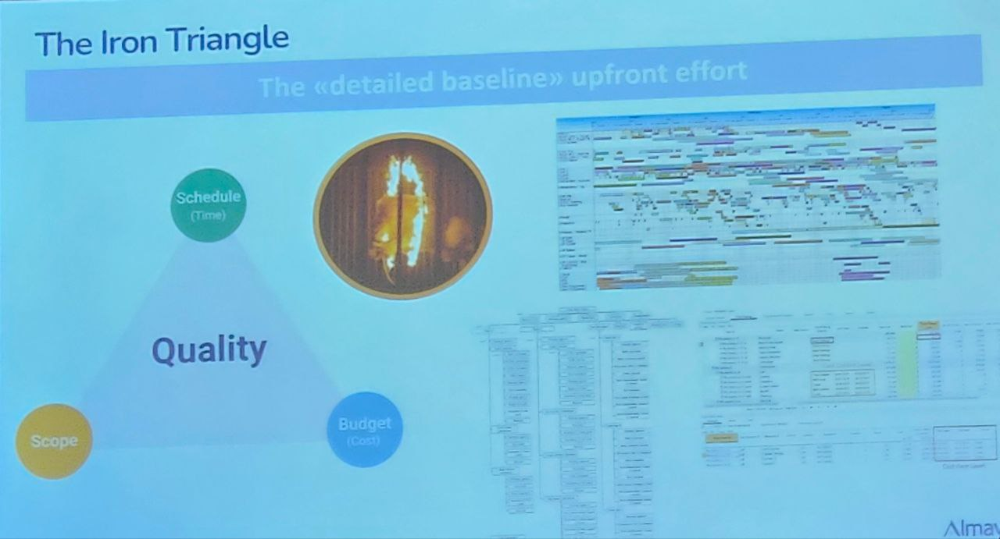
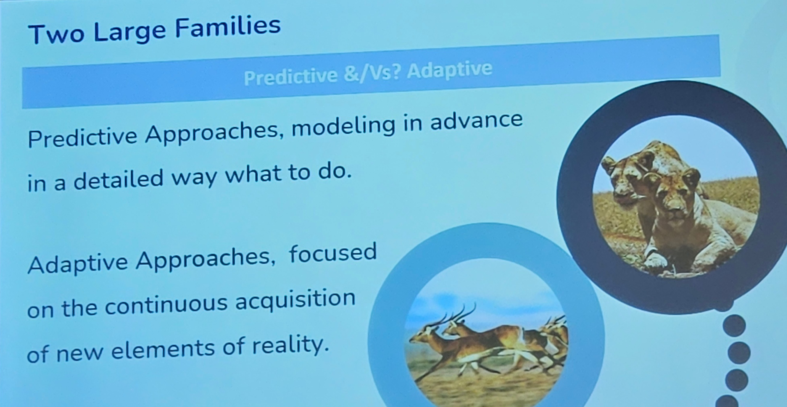
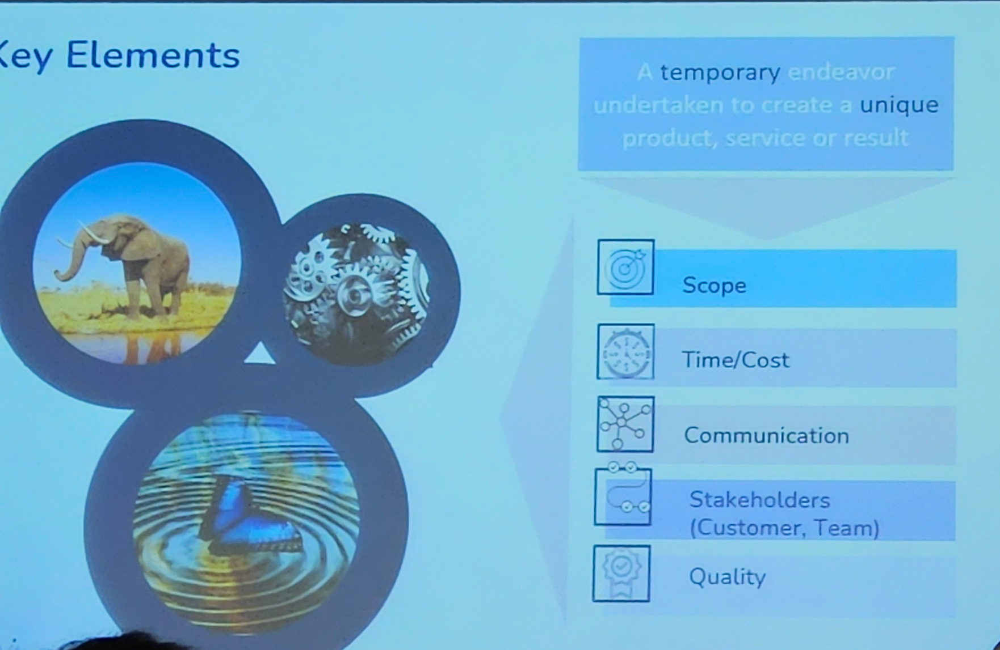
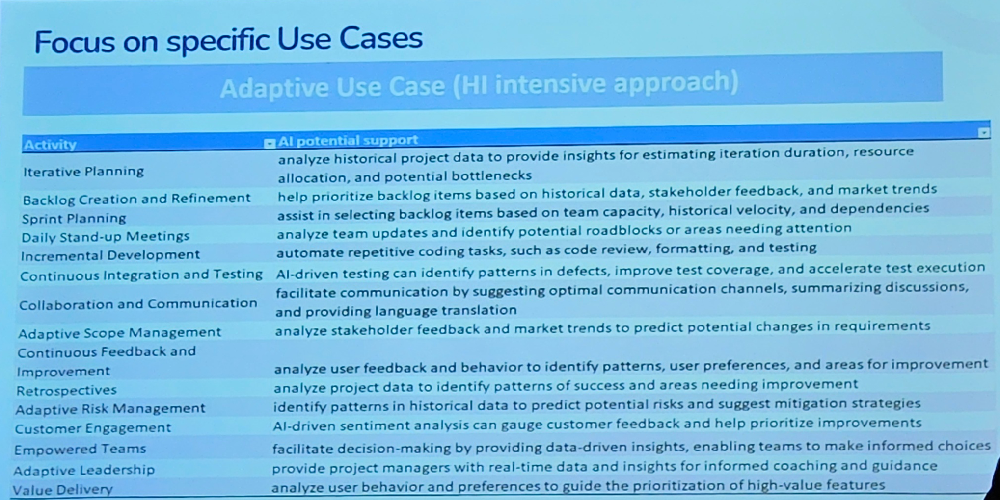

## General suggestions for the presentation
- It is **not required** to use data from papers/surveys;
- Not only open questions in the surveys;
- It must be **innovative** as **new data**, not the topic;
- **Showing the distribution** between men and women is nice;
- IF the project is related to surveys &rarr; Prof. asks about economic indicators;
- ELSE IF the project is about economics &rarr; Prof. asks about other things.
    - Even if you use economic indicators, you will still be asked questions about them.

## Typical structure
- **Title** - Name of Student;
- **Introduction**;
- **Research objectives** (for an online questionnaire, at least 100 people are needed).
- **Methodology** (Must use a methodology discussed in class).
    
    > ℹ️ **Note**: This slide should contain all the used methodologies, then analyze methodologies individually.

- **Results**. For the analysis of the results:
    - Sex = man/woman/prefer not to answer;
    - Age >= 18.
- **Conclusion**.

> **⚠️ Attention**: Discuss the central points with the Prof. before the presentation.

## Notes taken from presentations

### Presentation 1 (Building a startup is easy)
- Why the project was born;
- The case study 

### Presentation 2
- Introduction;
- Scope;
- Survey methodology: Online form using a Likert Scale;
- Answers given by the interviewees:
    - What are the average data?;
    - Average of the answers;
    - Consider the averages.

### Presentation 3
- Insert an index;
- Methodology: Survey with Likert scale for the MCDA;
- Introduction;
- Project Goal;
- The respondent distribution;
- Analysis results.
- AHP;
    - The table is shown
    - Normalized comparision matrix is shown;
- Cost Analysis of his possible activity.

### Alma Viva - Project management methodologies
- Management means *making something with your hands*, projecting something. A project is something **temporary**, **unique**, something **new**;
- Adaptive approach is **not flexible** in time;
- WoW: Way of Working: it is a fundamental element for increasing the chances of success of a team in carrying out a project or achieving an objective. 

#### Some important slide (maybe)

   